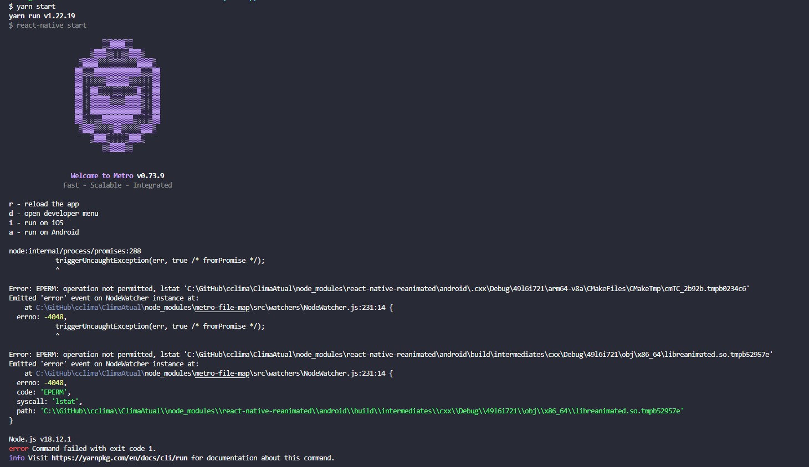

<h1 align="center">
  Clima Atual
</h1>

<br>

## 💻 Projeto

Aplicação construída com **[React Native](https://reactnative.dev/)**, com o objetivo de buscar o clima metereológico disponivel na api da **[Weather](https://hgbrasil.com/status/weather)**.

## 🚀 Informações

O design e tela pode ser encontrado neste [Figma Community](https://www.figma.com/community/file/1158928016905524023) criado pela [@becabelin](https://www.figma.com/@becabelin).

## 🚀 Resultado do projeto


## 🎲 Executar aplicação

```bash
# Clone este repositório
$ git clone https://github.com/WillianMedeiros14/ClimaAtual.git

# Entre na pasta do projeto.
$ cd ClimaAtual

# Instale as dependências
$ yarn install

# Execute a aplicação (Android)
# Em uma aba execute
$ yarn start
# Em outra aba execute
$ yarn android

```

## 🚀 Principais recursos e recnologias ultilizadas

- **[React Native](https://reactnative.dev/)**.
- **[Typescript](https://www.typescriptlang.org/)**
- **[Styled-components](https://styled-components.com/docs)**.
- Os dados ultilizados foram obtidos da api **[Weather](https://hgbrasil.com/status/weather)**.

<br>

## 💻 Outras informações

### - Executar aplicação no iOS

- Não pude testar no iOS por não possui no momento um Mac OS.

### - Erro de metro

- Caso ocorra o erro abaixo:
  <br>
  

- Para conseguir rodar e solucionar, basta rodar novamente o mesmo comando, ou seja, yarn start

<br><br><br>
Feito com 🧡 por Willian Medeiros.
